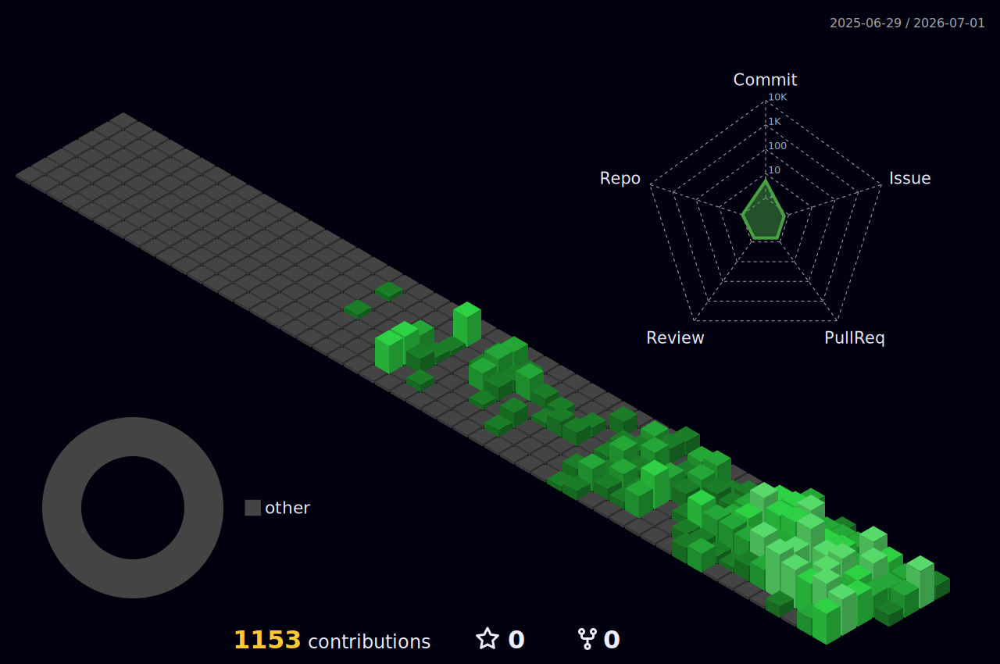

<h1 align="center">Angelo Ortiz Vega</h1>
<h3 align="center">Fullstack AI Engineer</h3>

  Fullstack AI Engineer building production-grade AI products, APIs, and user-facing applications.

## What I Deliver

- AI integrations ready for production environments
- Backend APIs and orchestration for ML-enabled workflows
- Web interfaces that expose AI capabilities to business teams and end users
- End-to-end implementation from architecture to deployment
- Product-oriented thinking to align technical decisions with business outcomes
- UX-focused implementation to improve usability and user adoption
- CX-aware delivery to ensure consistent, high-quality customer experiences

## Current Focus

- Designing and shipping reliable AI features with measurable business impact
- Improving quality, observability, and performance in AI product stacks
- Time management and delivery planning to keep priorities, scope, and deadlines aligned
- Technical leadership across discovery, implementation, and cross-functional collaboration
- Ownership mindset with clear communication, accountability, and continuous improvement

## Location & Timezone

- 🇨🇷 Costa Rica (UTC-6)

## Open to (Internal)

- Cross-team internal initiatives with product and engineering impact
- AI architecture and technical design for new or evolving internal platforms
- Mentoring, technical coaching, and enablement for engineering teams

## Tech Stack

- **Languages:** Python, TypeScript, JavaScript, PHP, SQL
- **Backend & APIs:** Node.js, FastAPI, REST API design, service orchestration
- **Frontend:** React, Ember.js, component-driven interfaces, UX-focused implementation
- **Data & AI:** LLM integrations, ML-enabled workflows, prompt and context orchestration
- **Databases & Infra:** PostgreSQL, Docker, AWS, production deployment and monitoring

  
  &nbsp;
  

  

